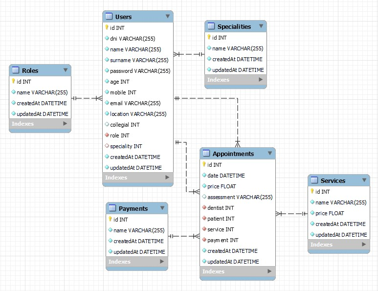

# API de una clínica dental
<details>
  <summary>Contenido 📝</summary>
  <ol>
    <li><a href="#objetivo">Objetivo</a></li>
    <li><a href="#sobre-el-proyecto">Sobre el proyecto</a></li>
    <li><a href="#diagrama-er">Diagrama Entidad Relación</a></li>
    <li><a href="#tecnologías-utilizadas">Stack - Tecnologías utilizadas</a></li>
    <li><a href="#instalación-en-local">Instalación en local</a></li>
    <li><a href="#endpoints">Endpoints</a></li>
    <li><a href="#contribuciones">Contribuciones</a></li>
    <li><a href="#agradecimientos">Agradecimientos</a></li>
    <li><a href="#contacto">Contacto</a></li>
    <li><a href="#licencia">Licencia</a></li>
  </ol>
</details>

## Objetivo
Este proyecto requería una API funcional conectada a una base de datos con al menos una relación de uno a muchos y una relación de muchos a muchos.

## Sobre el proyecto
Esta API ha sido desarrollada por **Héctor Mateu**, como cuarto proyecto del **Bootcamp de Full Stack Developer de Geekshubs Academy**, el cuál se basa en el diseño del backend de una aplicación. El cuál es totalmente funcional y se le puede atacar mediante POSTMAN.

## Diagrama ER


## Tecnologías utilizadas
         

## Instalación en local
1. Clonar el repositorio
2. ` $ npm install `
3. Conectamos nuestro repositorio con la base de datos 
4. ``` $ Ejecutamos las migraciones ``` 
5. ``` $ Ejecutamos los seeders ``` 
6. ``` $ npm run dev ```

## Endpoints
<details>
<summary>Endpoints</summary>

- **auth**
    - **/register**

            POST http://localhost:5000/auth/register
        body:
        ``` js
            {
                "dni": "35471123Z",
                "name": "Héctor",
                "surname": "Mateu Ortolá",
                "password": "1234",
                "age": 28,
                "mobile": 630174559,
                "email": "hector@gmail.com",
                "location": "C/ Pintor Perales"
            }
        ```
    - **/login**

            POST http://localhost:5000/auth/login  
        body:
        ``` js
            {
                "email":"hector@gmail.com",
                "password":"1234"
            }
        ```
- **usuarios**
    - **/users** : Recuperar todos los usuarios (debes estar logueado como dentista o admin)  

            GET http://localhost:5000/users

    - **/users/perfil** : Recupera toda la información del usuario logueado  

            GET http://localhost:5000/users/perfil

    - **/users** : Modificar los datos del usuario logueado

            PUT http://localhost:5000/users

    - **/users/:id** : Elimina el usuario con el id que le pases por parámetro (debes estar logueado como admin)

            DELETE http://localhost:5000/users/2

- **citas**
    - **/appointments** : Recupera toda las citas (debes estar logueado como dentista o admin)  

            GET http://localhost:5000/appointments

    - **/appointments/patient** : Recupera todas las citas del usuario logueado  

            GET http://localhost:5000/appointments/patient

    - **/appointments/dentist** : Recupera todas las citas del usuario, donde este haya sido dentista  

            GET http://localhost:5000/appointments/dentist

    - **/appointments/:id** : Recupera la cita con el id que le pases por argumento, siempre que seas paciente de dicha cita

            GET http://localhost:5000/appointments/2

    - **/appointments** : Crea una cita para el paciente logueado

            POST http://localhost:5000/appointments

    - **/appointments/:id** : Modifica la cita con el id que le pases por argumento, siempre qeu seas paciente de dicha cita

            PUT http://localhost:5000/appointments/2

    - **/appointments/:id** : Borra la cita con el id que le pases por argumento (debes estar logueado como admin)

            DELETE http://localhost:5000/appointments/2
</details>

## Contribuciones
Las sugerencias y aportaciones son siempre bienvenidas.  

Puedes hacerlo de dos maneras:

1. Abriendo una issue
2. Crea un fork del repositorio
    - Crea una nueva rama  
        ```
        $ git checkout -b feature/nombreUsuario-mejora
        ```
    - Haz un commit con tus cambios 
        ```
        $ git commit -m 'feat: mejora X cosa'
        ```
    - Haz push a la rama 
        ```
        $ git push origin feature/nombreUsuario-mejora
        ```
    - Abre una solicitud de Pull Request

## Agradecimientos
Agradezco a mis profesores el tiempo dedicado a este proyecto:

- **Dani**  
<a href="https://github.com/Datata" target="_blank"></a> 

- **David**
<a href="https://github.com/Dave86dev" target="_blank"></a>

## Contacto
<a href = "mailto:hmateu.ortola@gmail.com"></a> <a href="https://www.linkedin.com/in/h%C3%A9ctor-mateu-ortol%C3%A1-278b92160/" target="_blank"></a> 
## Licencia
Este proyecto se ha realizado bajo la **licencia MIT**.